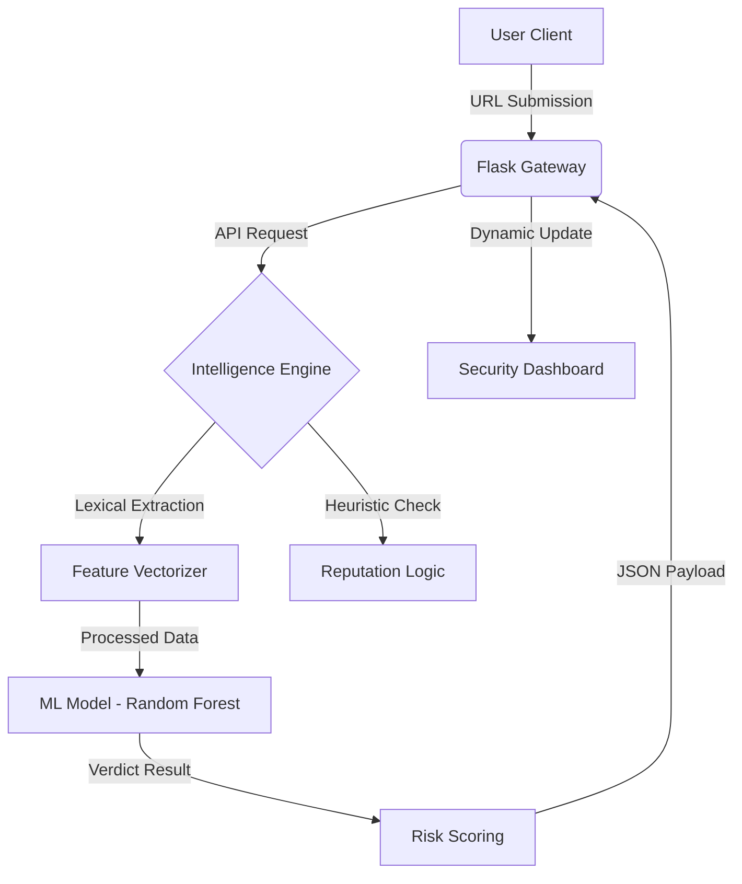

<div align="center">

# 🛡️ Phishing & Fake Website Detection System
### *Advanced AI-Driven Threat Intelligence & URL Analysis*

[](https://www.python.org/)
[](https://flask.palletsprojects.com/)
[](https://scikit-learn.org/)
[](LICENSE)
[](https://github.com/rcoecomphod/rcoeprj-121-1779-2278-group9)

---

[**🌐 Live Demo**](https://phishing-website-detection-1-qex8.onrender.com) • [**📂 Repository**](https://github.com/rcoecomphod/rcoeprj-121-1779-2278-group9.git) • [**🚀 Report Issue**](https://github.com/rcoecomphod/rcoeprj-121-1779-2278-group9.git/issues)

</div>

## 📑 Abstract

In an era of sophisticated digital deception, our **Phishing Detection System** serves as a robust intelligence layer. By synthesizing **Machine Learning algorithms** with real-time heuristic analysis, the platform identifies malicious URLs before they compromise user security. 

Unlike reactive blacklisting, this system evaluates the **DNA of a URL**—analyzing lexical patterns, domain reputation, and structural integrity—to provide high-fidelity risk assessments in milliseconds.

> [!IMPORTANT]
> Developed as **Mini Project-I (MP-1)** for the **SE (COMP) Div B** curriculum (2025-2026) at **RCOE**, under the academic guidance of **Prof. Prathamesh Yadav**.

---

## 🚀 Key Capabilities

| Feature | Intelligence Description |
| :--- | :--- |
| **🛡️ Phishing Detection** | Proprietary lexical analysis detecting spoofed and malicious URL signatures. |
| **⚡ Real-time Scanning** | Instantaneous threat verification with low-latency API response. |
| **🤖 ML Prediction Engine** | High-accuracy classification trained on 50,000+ validated malicious samples. |
| **🔍 Keyword Analysis** | Detection of deceptive "banking" and "auth" triggers used in social engineering. |
| **📊 Confidence Scoring** | Granular risk percentages allowing for informed user-decision making. |
| **🌡️ Threat Meter** | Intuitive visual indicators (Safe / Suspicious / Dangerous) for rapid triage. |
| **🖥️ Cyber Dashboard** | Dark-themed, enterprise-grade interface for centralized threat monitoring. |

---

## 🏗️ System Architecture



---

## 🧠 Machine Learning Workflow

1.  **Data Acquisition:** Aggregated intelligence from PhishTank and OpenPhish repositories.
2.  **Feature Engineering:** Extraction of 30+ unique properties (IP mapping, URL depth, SSL status).
3.  **Model Optimization:** Benchmarked performance across Random Forest, SVM, and XGBoost.
4.  **Deployment:** Serialized inference engine for cloud-native scalability.

---

## 🛠️ Installation & Setup

### 1. Repository Initialization
```bash
git clone https://github.com/rcoecomphod/rcoeprj-121-1779-2278-group9.git
cd Phishing-Website-Detection
```

### 2. Environment Configuration
```bash
python -m venv venv
# Windows
venv\Scripts\activate
# Linux/Mac
source venv/bin/activate
```

### 3. Dependency Deployment
```bash
pip install -r requirements.txt
python app.py
```

---

## 👥 The Team

| Project Member Name |
| :--- |
| **Nakade Abdul Nafea Nasir** (Team Leader) |
| **Shaikh Abdul Rahim Sultan Ahmed** |
| **Sayyed Zidan Nasir** |
| **Ansari Zaid Ayub** |

### 🎓 Academic Guidance
**Prof. Prathamesh Yadav**  
*Project Guide | Department of Computer Engineering*

---

## 🔮 Future Roadmap

- **🌐 Browser Shield:** Integrating detection directly into Chrome/Edge via extensions.
- **📱 Mobile Gateway:** Dedicated Android/iOS verification application.
- **🧠 Deep Learning:** Implementing LSTM architectures for sequence-based URL analysis.
- **🛡️ Enterprise API:** Enabling third-party integrations for organizational security.

---

## 📜 License & Contact

Distributed under the **MIT License**.

- **GitHub:** [rcoeprj-121-1779-2278-group9](https://github.com/rcoecomphod/rcoeprj-121-1779-2278-group9.git)
- **Deployment:** [Live Production Demo](https://phishing-website-detection-1-qex8.onrender.com)
- **Lead Developer:** [Abdul Nafea Nasir](#)

<div align="center">

**If this project helped your research, please give it a ⭐!**

*© 2026 Team Apex • RCOE Mumbai*

</div>
