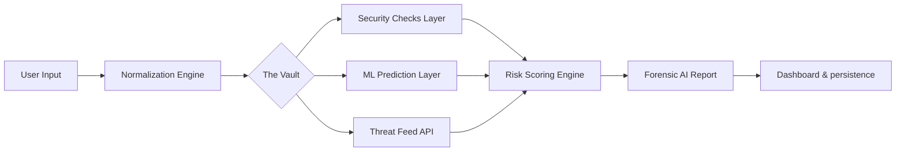

# <p align="center">⬡ NEXUS</p>
<p align="center">
  <strong>Real-time AI-powered Cyber Threat Intelligence Platform</strong><br>
  <i>Detecting phishing, malware, and social engineering threats with precision.</i>
</p>

<p align="center">
  
  
  
  
  
</p>

---

## 🚀 Overview

**NEXUS** is an advanced Cyber Threat Intelligence (CTI) system designed to identify and neutralize phishing threats in real-time. Built for the modern web, it combines academic machine learning research with industry-standard threat feeds to protect users from malicious digital infrastructure.

> [!IMPORTANT]
> **Abstract**: This project implements a multi-layer detection architecture using machine learning techniques and real-time security APIs to analyze website URLs and detect phishing attempts with 95%+ accuracy.

---

## ✨ Core Features

### 🔍 Intelligence & Detection
*   **🧠 Neural ML Engine**: Analyzes 30+ lexical and structural features of URLs to identify patterns invisible to the human eye.
*   **📡 Live Intel Feeds**: Direct integration with Google Safe Browsing, OpenPhish, and PhishTank.
*   **🔐 Infrastructure Audit**: Automated SSL/TLS certificate validation and DNS/WHOIS reputation checks.
*   **🕵️ DNA Analysis**: Detects look-alike (Typosquatting) domains and suspicious TLD patterns.

### 💻 User Experience
*   **📊 Security Dashboard**: Personalized scan history and threat activity tracking.
*   **⚡ AJAX Deep Scan**: High-performance, no-reload scanning pipeline with cinematic feedback.
*   **🤖 Forensic AI Explainer**: Natural language breakdown of *why* a URL is considered dangerous.
*   **🌑 Premium Dark UI**: Modern, glassmorphism-inspired interface optimized for focus and speed.

---

## 🧠 Advanced Detection Engine

NEXUS doesn't just check a list; it performs a full forensic audit:

1.  **Lexical Analysis**: Entropy checks, length validation, and keyword-to-domain ratio analysis.
2.  **Reputation Scoring**: Querying global threat registries and blacklists.
3.  **Infrastructure Health**: Verifying the legitimacy of the hosting provider and domain age.
4.  **ML Inference**: Running features through a trained classification model to predict "Zero-Day" phishing sites that haven't been blacklisted yet.

---

## 🏗️ System Architecture



**Workflow Architecture**:
- **Ingress**: Normalizes and cleans the raw URL/Input.
- **Analysis**: Parallel execution of DNS, SSL, and ML heuristics.
- **Synthesis**: Scoring engine weighs signals to generate a final risk percentage.
- **Persistence**: Secure storage in SQLite for historical analytics.

---

## ⚙️ Technology Stack

| Layer | Technology | Purpose |
| :--- | :--- | :--- |
| **Backend** | Python / Flask | Core application logic & routing |
| **Machine Learning** | Scikit-Learn / Pickle | Predictive classification engine |
| **Database** | SQLite / SQLAlchemy | User data & scan history persistence |
| **Security APIs** | Google Safe Browsing | Global threat intelligence synchronization |
| **Frontend** | Vanilla JS / CSS3 / HTML5 | Responsive, high-performance UI |
| **Auth** | Flask-Bcrypt / Login | Secure session & identity management |

---

## 📸 Project Showcase

### Dashboard Preview
> [!NOTE]
> *Insert Dashboard Screenshot Here*

### Live Scan Analysis
> [!NOTE]
> *Insert URL Scanner Analysis Screenshot Here*

---

## 🧪 How It Works (Step-by-Step)

1.  **Input Submission**: User pastes a suspicious link into the NEXUS vault.
2.  **Heuristic Probe**: System checks domain age, SSL status, and DNS integrity.
3.  **Pattern Recognition**: ML model analyzes the URL string for malicious characteristics.
4.  **Global Query**: The link is cross-referenced with Google Safe Browsing.
5.  **Intelligence Report**: A unified risk score $(0-100)$ is generated with a detailed forensic explanation.

---

## ⚡ Deployment & Setup

### Local Installation
```bash
# 1. Clone & Enter
git clone https://github.com/way2nafea/Phishing-Website-Detection.git
cd Phishing-Website-Detection

# 2. Setup Environment
python -m venv venv
source venv/bin/activate  # Windows: venv\Scripts\activate

# 3. Install Dependencies
pip install -r requirements.txt

# 4. Run Nexus
python app.py
```

### Live Production
The system is optimized for **Render** and **Vercel** deployments.
- **Live Demo**: [https://phishing-website-detection-1-qex8.onrender.com](https://phishing-website-detection-1-qex8.onrender.com)

---

## 👨‍💻 Project Team

| Name | Role | Profile |
| :--- | :--- | :--- |
| **Nakade Abdul Nafea Nasir** | **Team Leader** | [GitHub](https://github.com/way2nafea) |
| Shaikh Abdul Rahim Sultan Ahmed | Core Developer | [GitHub](#) |
| Sayyed Zidan Nasir | ML Engineer | [GitHub](#) |
| Ansari Zaid Ayub | UI/UX Designer | [GitHub](#) |

**Project Guide**: `Prof. Prathamesh Yadav` (Primary Guide)  
**Academic Year**: `SE (COMP) Div B - 2025-2026`  
**Institue**: `Mini Project-I (MP-1)`

---

## 📚 Datasets & References

*   **Datasets**: [Kaggle Phishing Dataset](https://kaggle.com/), [URLHAUS Abuse.ch Feed](https://urlhaus.abuse.ch/)
*   **Threat Intel**: [Google Safe Browsing API](https://developers.google.com/safe-browsing)
*   **Protocols**: [WHOIS & DNS Standards](https://www.iana.org/assignments/whois-parameters/)

---

## 🎯 Future Scope
- [ ] **Nexus Browser Extension**: Real-time browser protection.
- [ ] **Advanced Deep Learning**: Transitioning to LSTM/Transformer models.
- [ ] **Enterprise API**: Exposing detection as a RESTful service.
- [ ] **Visual Analysis**: Automated website screenshot and favicon fingerprinting.

---

## 🧾 License & Contribution

This project is licensed under the academic guidelines of MP-1. Contributions are welcome for non-commercial educational purposes.

---
<p align="center">Made with ❤️ by Team NEXUS</p>
