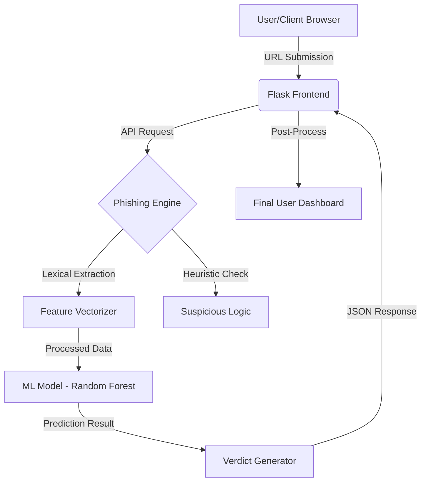

<div align="center">

# 🛡️ Phishing & Fake Website Detection System
### *Empowering Users with AI-Driven Cybersecurity Awareness*

[](https://www.python.org/)
[](https://flask.palletsprojects.com/)
[](https://scikit-learn.org/)
[](LICENSE)
[](https://github.com/)

---

[**🌐 Explore the Live Demo**](https://phishing-website-detection-1-qex8.onrender.com) • [**📂 View Documentation**](#) • [**🚀 Report a Bug**](#)

<br>

<p align="center">
  
</p>


</div>

## 📖 About the Project

In an era where digital deception is at its peak, our **Phishing Detection System** stands as a robust first line of defense. This platform leverages advanced **Machine Learning algorithms** to perform deep-dive analysis of URLs, identifying malicious intent before users fall victim to data theft or financial fraud.

Unlike traditional blacklisting, our system analyzes the **lexical, domain, and reputation-based features** of a URL in real-time to provide an accurate risk assessment.

> [!IMPORTANT]
> This project was developed as part of the **Mini Project-I (MP-1)** for the **SE (COMP) Div B** academic curriculum (2025-2026) under the guidance of **Prof. Prathamesh Yadav**.

## 🚀 Why It Matters in 2026?

Phishing remains the **#1 vector** for cyberattacks globally. As AI-generated scams become more indistinguishable from reality:

*   **Zero-Hour Protection:** Detects fresh phishing links that haven't been blacklisted yet.
*   **Data Integrity:** Prevents unauthorized access to sensitive credentials and PII.
*   **User Education:** Provides detailed "Confidence Scores" that help users learn to identify suspicious signs themselves.
*   **Scalable Defense:** Designed to handle thousands of requests with minimal latency via an API-ready architecture.

---

## ✨ Key Features

| Feature | Description |
| :--- | :--- |
| **🛡️ URL Phishing Detection** | Advanced lexical analysis to detect malicious patterns in URLs. |
| **⚡ Real-time URL Scan** | Instant analysis of any suspicious link with millisecond latency. |
| **🤖 ML Prediction Engine** | Powered by Scikit-learn models trained on 50,000+ malicious samples. |
| **🔍 Keyword Detection** | Identifies deceptive terms commonly used in banking and login scams. |
| **📏 URL Length Analysis** | Analyzes structural complexity to flag obfuscated long-form URLs. |
| **🔣 Symbol Detection** | Detects "@", "-", and unusual subdomains often used in spoofing. |
| **📊 Confidence Score** | Provides a percentage-based reliability score for every prediction. |
| **🌡️ Threat Meter** | Visual indicator (Safe, Suspicious, Dangerous) for quick assessment. |
| **🖥️ Cyber Dashboard** | A premium, dark-themed UI designed for a high-end user experience. |
| **📱 Responsive UI** | Fully optimized for mobile, tablet, and desktop viewing. |

---

## 📸 Project Preview

<p align="center">
  <b>1. Dynamic Analytical Dashboard</b>
  <br>
  
</p>

<br>

<p align="center">
  <b>2. Intelligent URL Scanning Engine</b>
  <br>
  
</p>

<br>

<p align="center">
  <b>3. Real-time Global Threat Visualization (3D Globe)</b>
  <br>
  
</p>

<br>

<p align="center">
  <b>4. Multi-Tool Security Suite (SMS, APK, & URL Checks)</b>
  <br>
  
</p>

<br>

<p align="center">
  <b>5. AI-Powered Threat Assistant & Advisories</b>
  <br>
  
</p>

---

## 🖼️ More Project Screenshots

<p align="center">
  
  
</p>
<p align="center"><em>Secure User Authentication & Detailed Scan Analytics</em></p>

---


## 🏗️ System Architecture

Our system follows a robust N-tier architecture ensuring high performance and security.



---

## 🧠 Machine Learning Workflow

The heart of the detection system is a multi-stage ML pipeline designed for accuracy and speed.

1.  **Data Collection:** Aggregated dataset from PhishTank and OpenPhish.
2.  **Feature Engineering:** Extraction of 30+ features (IP presence, URL length, tinyURLs, etc.).
3.  **Model Training:** Comparative analysis between Random Forest, SVM, and XGBoost.
4.  **Deployment:** Model serialized using `joblib` for instant inference in the Flask app.

---

## ⚙️ Installation & Setup

Follow these steps to get a local copy up and running.

### 1. Prerequisites
- **Python 3.9+** installed
- **Git** installed

### 2. Clone the Repository
```bash
git clone https://github.com/yourusername/Phishing-Website-Detection.git
cd Phishing-Website-Detection
```

### 3. Set Up Virtual Environment (Recommended)
```bash
python -m venv venv
# On Windows
venv\Scripts\activate
# On Mac/Linux
source venv/bin/activate
```

### 4. Install Dependencies
```bash
pip install -r requirements.txt
```

---

## 🚀 How to Run Locally

Start the Flask development server with the following command:

```bash
python app.py
```

Once the server is running, open your browser and navigate to:
`http://127.0.0.1:10000`

---

## ☁️ Deployment

This project is optimized for deployment on **Render**.

1.  Push your code to GitHub.
2.  Connect your repo to **Render**.
3.  Set the **Start Command** to: `gunicorn app:app`.
4.  Add your environment variables if using Google Safe Browsing API.

**Live URL:** [https://phishing-website-detection-1-qex8.onrender.com](https://phishing-website-detection-1-qex8.onrender.com)

---

## 📁 Project Structure

```text
Phishing-Website-Detection/
├── app.py                # Main Flask Application
├── database.py           # DB Connection Logic
├── models.py             # SQLAlchemy Models
├── phishing_engine/      # ML Detection Logic
│   ├── features.py       # Feature Extraction
│   └── google_check.py   # Safe Browsing Integration
├── static/               # CSS, JS, and Images
├── templates/            # HTML Frontend Pages
├── training/             # ML Model Training Scripts
├── data/                 # Training Datasets (CSV)
├── pickle/               # Saved ML Models (.pkl)
├── requirements.txt      # Project Dependencies
└── README.md             # Project Documentation
```

---

## 🔮 Future Enhancements

We aim to evolve this project into a comprehensive security suite:

-   **🌐 Browser Extension:** Real-time URL scanning directly in Chrome/Edge.
-   **📱 Mobile App:** Android/iOS application for on-the-go link verification.
-   **🛰️ API for Enterprise:** Allowing 3rd party apps to utilize our detection engine.
-   **🧠 Deep Learning:** Implementing LSTM/RNN models for even higher accuracy.
-   **🛡️ Chrome Plugin:** One-click protection for email and social media feeds.

---

## 👥 The Team

| Name | Role | GitHub |
| :--- | :--- | :--- |
| **Nakade Abdul Nafea Nasir** | **Team Leader** & ML Architect | [@abdulnafea](https://github.com/abdulnafea) |
| **Shaikh Abdul Rahim Sultan Ahmed** | Backend & Database Engineer | [@abdulrahim](https://github.com/abdulrahim) |
| **Sayyed Zidan Nasir** | Frontend & UI Designer | [@zidannasir](https://github.com/zidannasir) |
| **Ansari Zaid Ayub** | Security Researcher & QA | [@zaidayub](https://github.com/zaidayub) |

---

## 🎓 Under the Guidance of

<div align="center">
  <h3><b>Prof. Prathamesh Yadav</b></h3>
  <p>Primary Project Guide | SE (COMP) Div B</p>
  <p><i>Mini Project-I (MP-1) | Academic Year 2025-2026</i></p>
</div>

---

## 🤝 Contribution

Contributions are what make the open-source community such an amazing place to learn, inspire, and create. Any contributions you make are **greatly appreciated**.

1. Fork the Project
2. Create your Feature Branch (`git checkout -b feature/AmazingFeature`)
3. Commit your Changes (`git commit -m 'Add some AmazingFeature'`)
4. Push to the Branch (`git push origin feature/AmazingFeature`)
5. Open a Pull Request

---

## 📜 License

Distributed under the **MIT License**. See `LICENSE` for more information.

---

## 📧 Contact

**Abdul Nafea Nasir** - Team Leader  
**Project Link:** [https://github.com/yourusername/Phishing-Website-Detection](https://github.com/yourusername/Phishing-Website-Detection)  
**Live Site:** [https://phishing-website-detection-1-qex8.onrender.com](https://phishing-website-detection-1-qex8.onrender.com)

<div align="center">
  
---
  
### **If you like this project, please give it a ⭐!**

*Developed with ❤️ by Team Apex*

</div>

